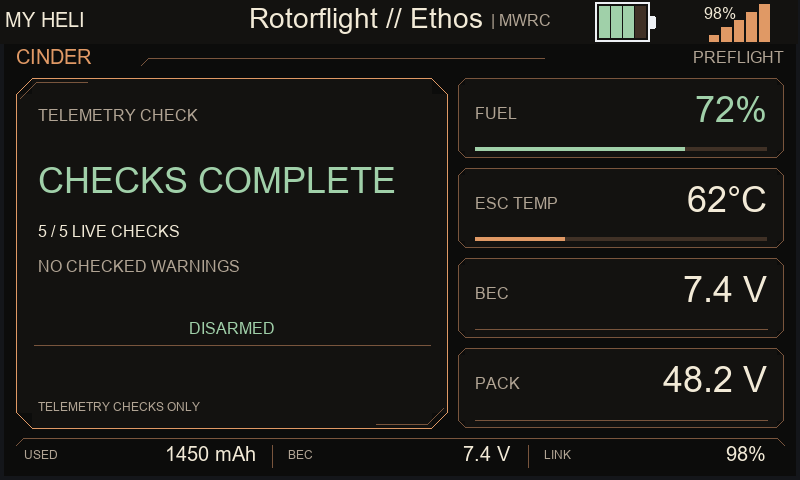
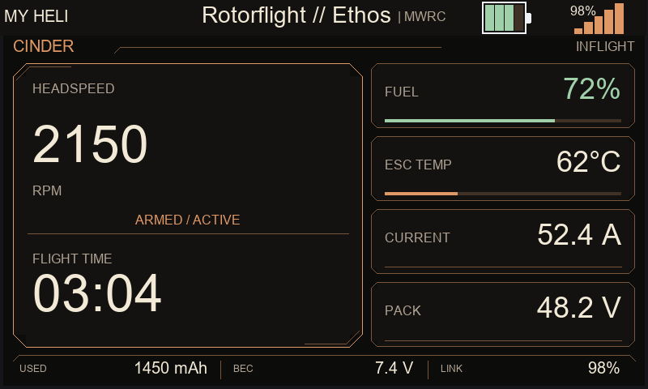
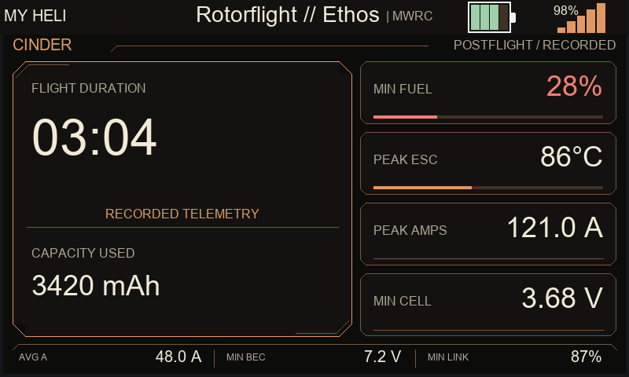

# Cinder desktop previews

Generated from the implemented theme through the Suite's Lua engine. Desktop
fonts approximate the radio; these are not radio screenshots. The 72 render
cases cover all phases, both sizes, three appearance modes, and four data states.
See `renders/results.json` for the checks.

## Preflight

## Inflight

## Postflight

Native radio acceptance remains outstanding. This branch contains only Cinder
and its four selection/configuration registrations. Optional Theme Bridge can
consume the supplied `appTheme` metadata after its own allowlist registration.
The CI registry also retains the existing profile-anchor check, correcting the
upstream registry mismatch without changing generated workflow behavior.
