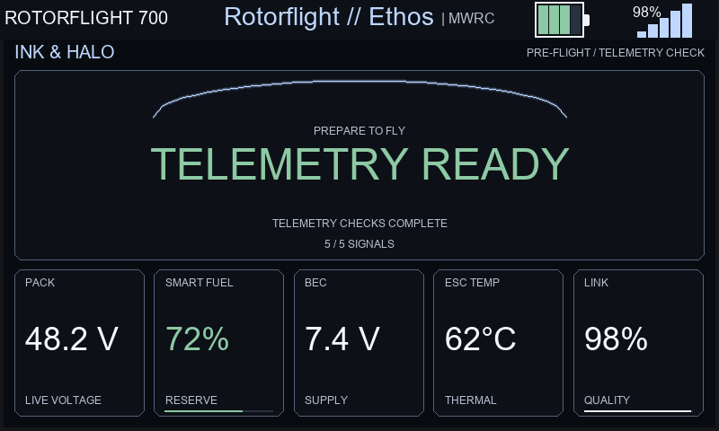
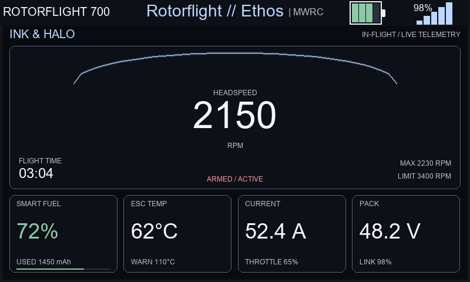
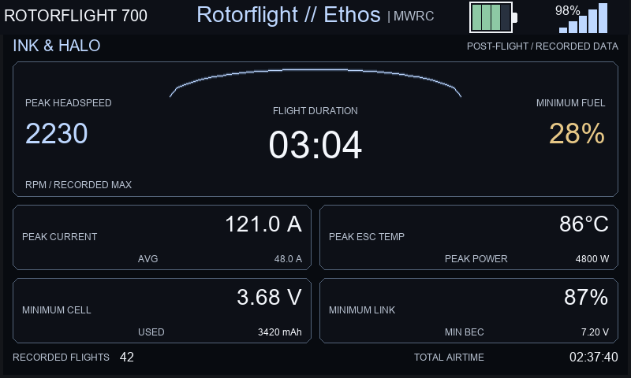

# Ink & Halo previews

Rendered from the actual Rotorflight theme modules with sample telemetry at
800 × 480 and 784 × 294. Desktop fonts approximate the radio's native fonts;
these images are not physical-radio screenshots.

## Preflight

## Inflight

## Postflight

The `renders` directory also contains compact views, appearance variants, and
machine-readable rendering results. See `tests/themes/README.md` for reproduction
commands. Theme selection still requires the Suite's explicit picker registration.
