# Dashboard Themes Overview

This overview shows the available dashboard themes and their preflight, inflight, and postflight screens.
You can change them via the Suite Menu "Settings - Dashboard - Theme"

## AERC

| Preflight | Inflight | Postflight |
| --- | --- | --- |
|  |  |  |

## AERC-Nitro

| Preflight | Inflight | Postflight |
| --- | --- | --- |
|  |  |  |

## Basic Timer

| Preflight | Inflight | Postflight |
| --- | --- | --- |
|  |  |  |

## Claude

| Preflight | Inflight | Postflight |
| --- | --- | --- |
|  |  |  |

## DanielRC

| Preflight | Inflight | Postflight |
| --- | --- | --- |
|  |  |  |

## Default

| Preflight | Inflight | Postflight |
| --- | --- | --- |
|  |  |  |

## Gismo

| Preflight | Inflight | Postflight |
| --- | --- | --- |
|  |  |  |

## Kevd

| Preflight | Inflight | Postflight |
| --- | --- | --- |
|  |  |  |

## RF Status

| Preflight | Inflight | Postflight |
| --- | --- | --- |
|  |  |  |

## RT-RC

| Preflight | Inflight | Postflight |
| --- | --- | --- |
|  |  |  |

## RT-RC Nitro

| Preflight | Inflight | Postflight |
| --- | --- | --- |
|  |  |  |

## SRB-RC

| Preflight | Inflight | Postflight |
| --- | --- | --- |
|  |  |  |

## Bastion

Desktop previews at 800 × 480; these are not radio captures. Minimum window:
784 × 294. See the [theme guide](../dashboard/bastion.md).

| Preflight | Inflight | Postflight |
| --- | --- | --- |
| 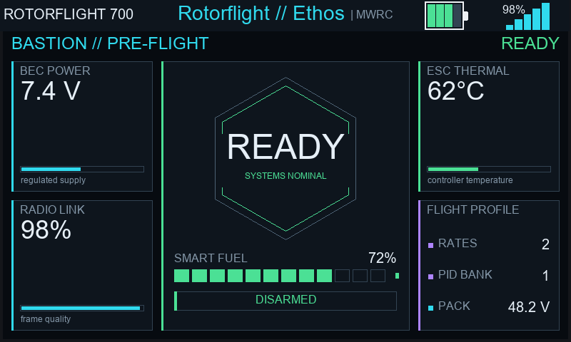 | 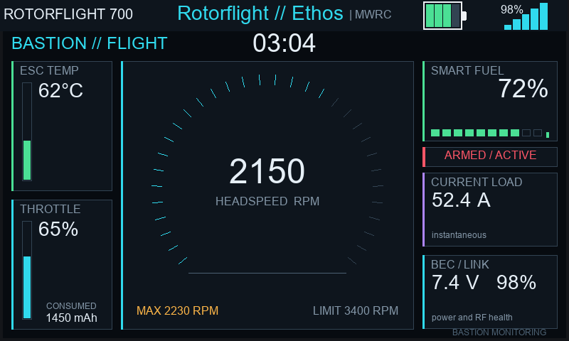 | 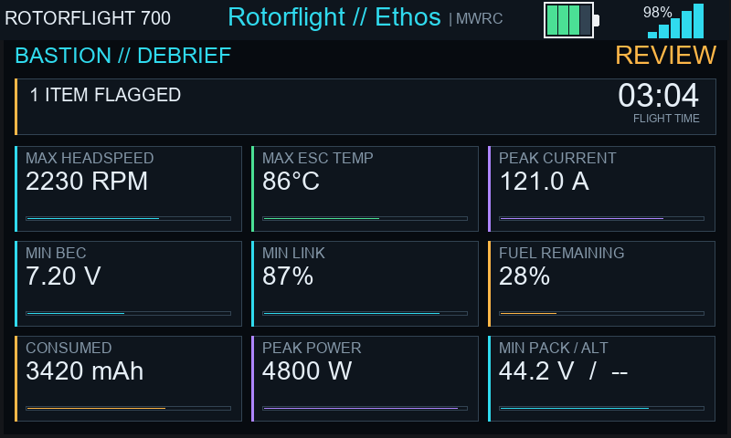 |

## America 250

Desktop previews at 800 × 480; these are not radio captures. Minimum window:
784 × 294. See the [theme guide](../dashboard/america250.md).

| Preflight | Inflight | Postflight |
| --- | --- | --- |
|  |  |  |

## Liberty Ops 250

Desktop previews at 800 × 480; these are not radio captures. Minimum window:
784 × 294. See the [theme guide](../dashboard/libertyops250.md).

| Preflight | Inflight | Postflight |
| --- | --- | --- |
|  |  |  |

## MWRC

Desktop previews at 800 × 480; these are not radio captures. Minimum window:
784 × 294. See the [theme guide](../dashboard/mwrc.md).

| Preflight | Inflight | Postflight |
| --- | --- | --- |
| 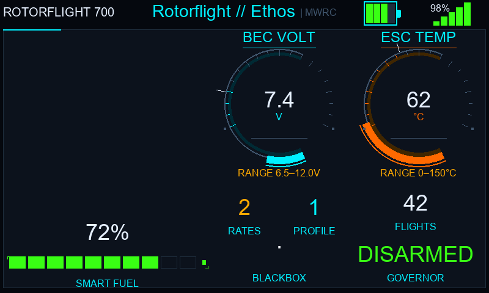 | 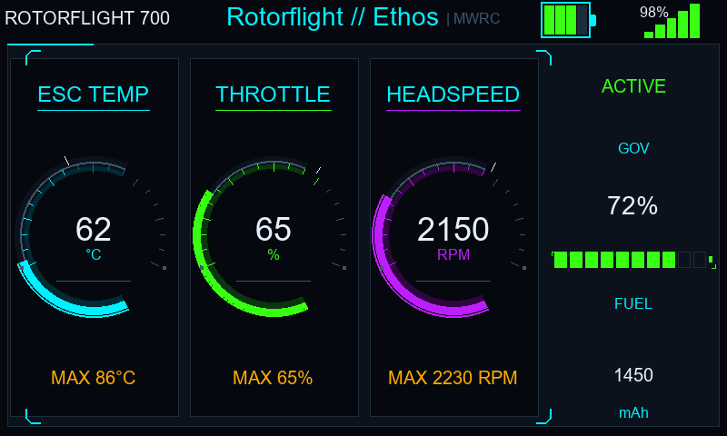 | 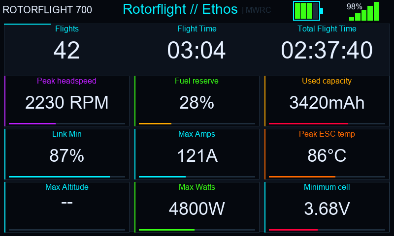 |

## Singularity

Desktop previews at 800 × 480; these are not radio captures. Minimum window:
784 × 294. See the [theme guide](../dashboard/singularity.md).

| Preflight | Inflight | Postflight |
| --- | --- | --- |
| 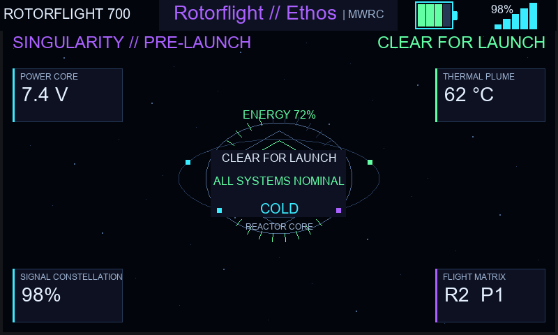 | 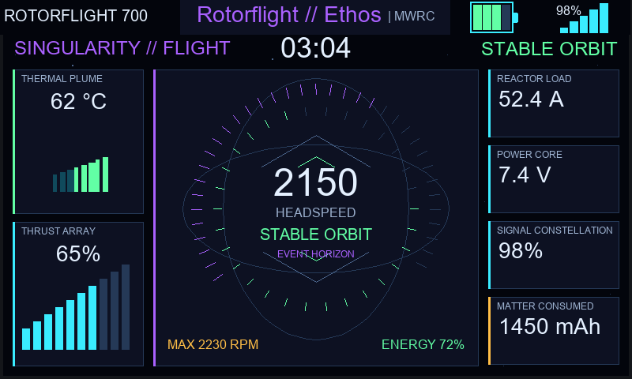 | 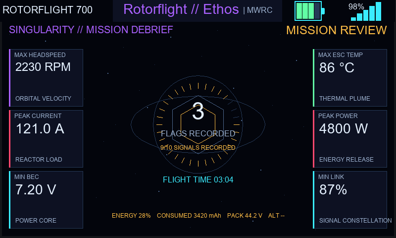 |

## Zafira

Desktop previews at 800 × 480; these are not radio captures. Minimum window:
784 × 294. See the [theme guide](../dashboard/zafira.md).

| Preflight | Inflight | Postflight |
| --- | --- | --- |
| 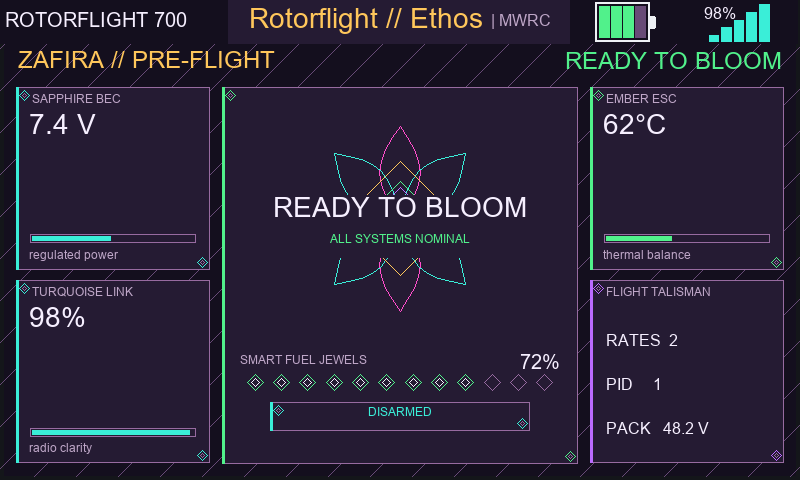 | 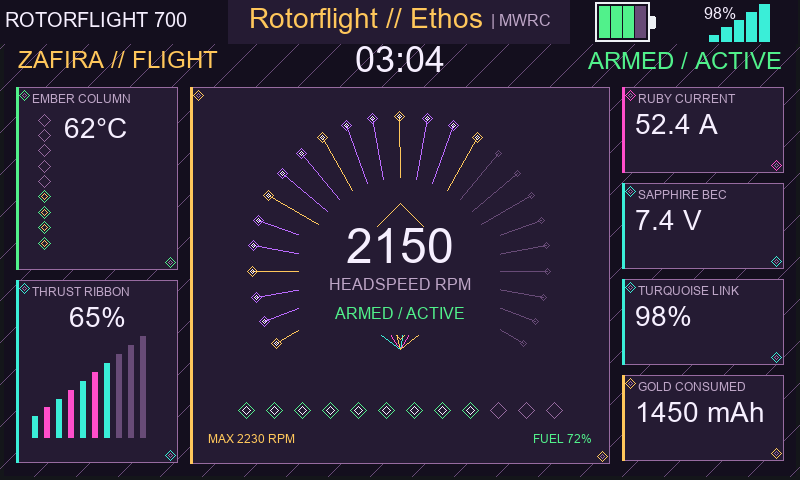 | 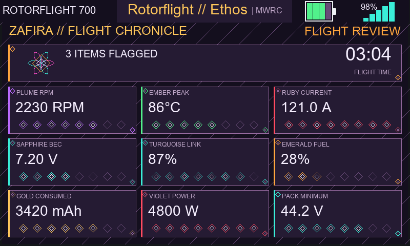 |

## Vantage

Desktop previews at 800 × 480; these are not radio captures. Minimum window:
784 × 294. See the [theme guide](../dashboard/vantage.md).

| Preflight | Inflight | Postflight |
| --- | --- | --- |
|  |  |  |

## Ink & Halo

Desktop previews at 800 × 480; these are not radio captures. Minimum window:
784 × 294. See the [theme guide](../dashboard/inkhalo.md).

| Preflight | Inflight | Postflight |
| --- | --- | --- |
|  |  |  |

## Meridian

Desktop previews at 800 × 480; these are not radio captures. Minimum window:
784 × 294. See the [theme guide](../dashboard/meridian.md).

| Preflight | Inflight | Postflight |
| --- | --- | --- |
| 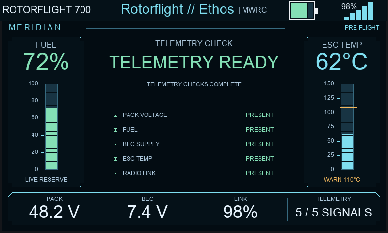 | 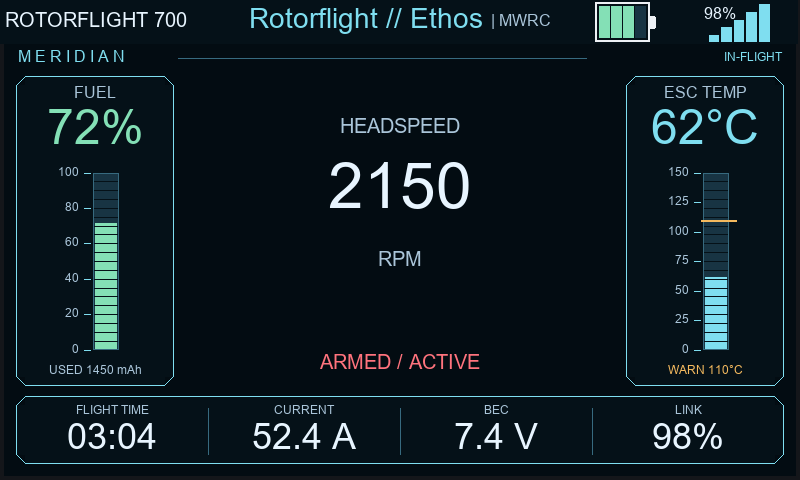 | 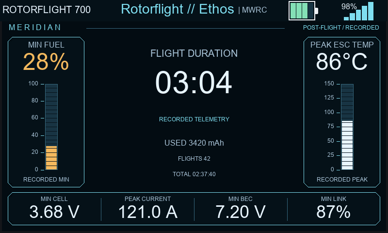 |

## Cinder

Desktop previews at 800 × 480; these are not radio captures. Minimum window:
784 × 294. See the [theme guide](../dashboard/cinder.md).

| Preflight | Inflight | Postflight |
| --- | --- | --- |
| 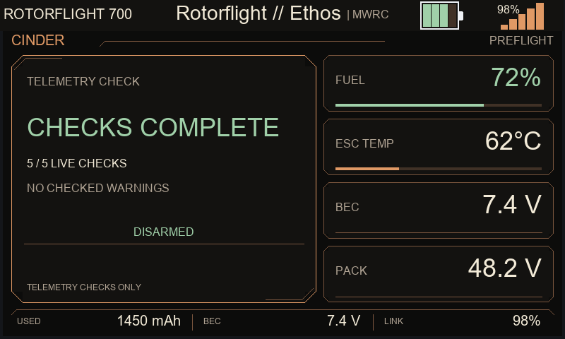 | 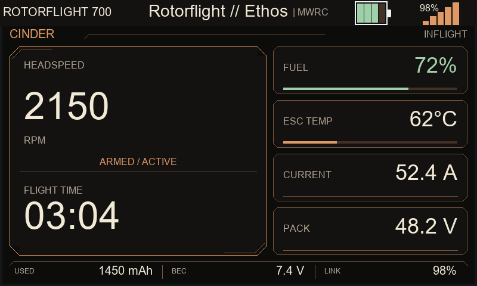 | 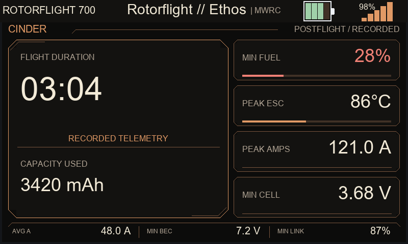 |
